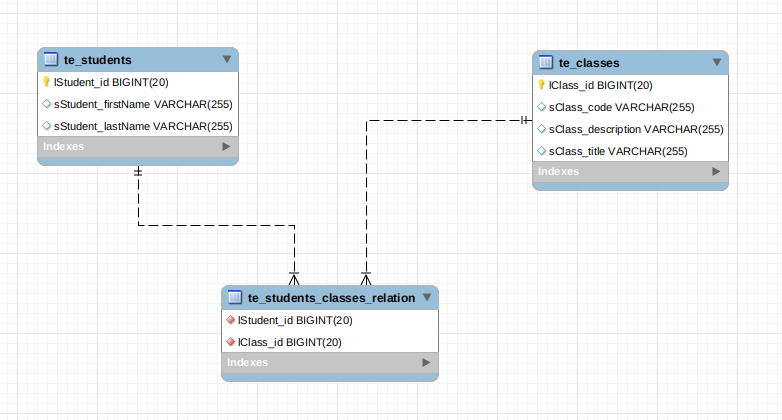

# TRUEXTEND Coding Challenge

## Requested Position
Intermediate Java Software Engineer

## Personal Data
**Name**: Eduardo Andres Soruco Alderete

**Email**: easorucoa94@gmail.com

**Phone Number**: +591 70060600

## Scope
Having the following models:

- **Student** =  { lStudentId, sStudentFirstName, sStudentLastName }

- **Class** =  { lClassId, sClassCode, sClassTitle, sClassDescription }

Develop a **REST API** to run the following operations:

- Create/Edit/Delete Student.
- Create/Edit/Delete Class.
- Browse list of all Students.
- Browse list of all Classes.
- View all Students assigned to a Class.
- View all Classes assigned to a Student.
- Search Student/Classes by available fields/associations.

## Solution Details

## How to import this project

## Package distribution
- **com.truextend.firstProblem**: Contains Spring Boot's main class, needed to run the application.
- **com.truextend.firstProblem.controllers**: Contains all restControllers involved in this solution.
- **com.truextend.firstProblem.entities**: Contains actors entities/models.
- **com.truextend.firstProblem.repositories**: Contains the Repository Classes layer.
- **com.truextend.firstProblem.services**: Contains the Service layer and its implementations **(~ServiceImpl.java)**

## Data Base details
**DBMS**: MySQL 5.7

### Access configured in the application
**Host**: localhost

**Port**: 3306

**DataBase**: truextendfirstproblem

**Username**: truextend

**Password**: truextend

### Data Base model


## Application endpoints
### http://{SERVER_URL}:{SERVER_PORT}/student
- **Path**: / (GET REQUEST) --- List all students

**Body**: none

**Reponse**: Collection of StudentEntity
```
[
    {
        "studentClasses": [],
        "studentFilteredClasses": null,
        "lstudentId": 4,
        "sstudentFirstName": "Adrian",
        "sstudentLastName": "Cuellar"
    }
]
```

### http://{SERVER_URL}:{SERVER_PORT}/class
- **Path**: / (GET REQUEST) --- List all classes

**Body**: none

**Reponse**: Collection of ClassEntity
```
[
    {
        "studentsInClass": [],
        "classFilteredStudents": null,
        "lclassId": 3,
        "sclassCode": "MAT-101",
        "sclassTitle": "Maths",
        "sclassDescription": "Learn maths"
    }
]
```
